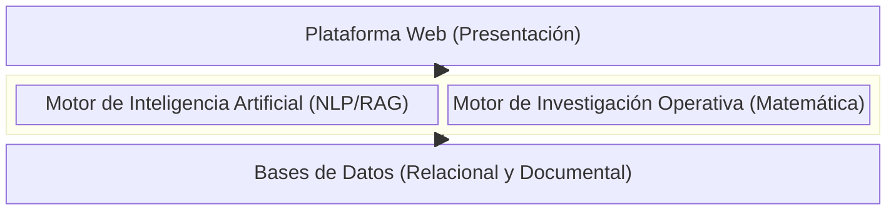
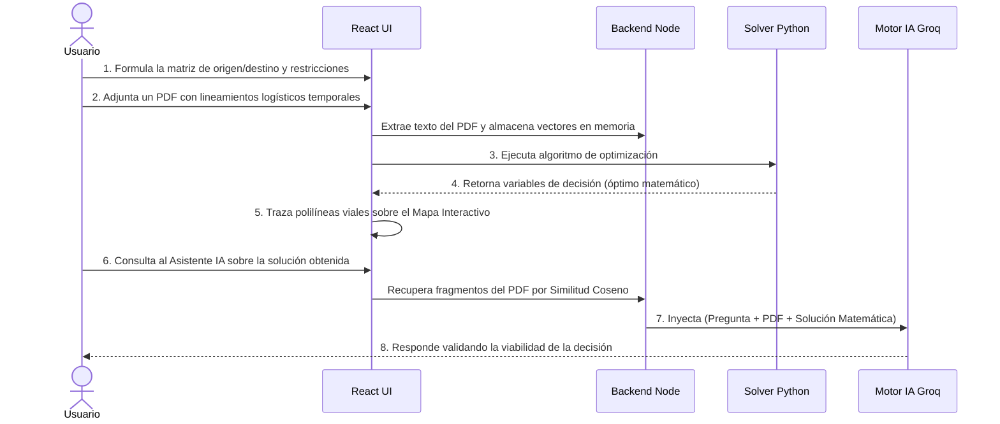

# Documentación Arquitectónica: Tech-Logistics IO

Este documento describe la arquitectura de software, el diseño lógico y la implementación técnica de **Tech-Logistics IO**, una plataforma de soporte a la toma de decisiones logísticas (DSS) que integra modelado matemático cuantitativo con capacidades de Inteligencia Artificial y Recuperación Aumentada (RAG).

---

## 1. El Problema de la Planificación Logística

La gestión de la cadena de suministro se enfrenta a un desajuste estructural entre la optimización teórica y la aplicación práctica:

*   **Toma de decisiones heurística:** Ante la imposibilidad matemática de calcular mentalmente miles de combinaciones de rutas, los planificadores recurren a reglas generales, lo que invariablemente resulta en sobrecostos.
*   **Aislamiento del modelo matemático:** Los motores de optimización puros (solvers) asumen un entorno ideal. No pueden leer normativas aduaneras, alertas meteorológicas ni manuales de operaciones redactados en texto libre (PDFs).
*   **Fricción cognitiva en la interpretación:** Los resultados de un solver (matrices numéricas, holguras, variables de decisión) carecen de contexto de negocio inmediato para los directivos. Se requiere un intermediario que interprete el dato puro y lo convierta en estrategia.

---

## 2. Propuesta de Valor: ¿Qué hace diferente a Tech-Logistics IO?

Tech-Logistics IO resuelve la fricción entre la matemática y la semántica corporativa integrando cuatro pilares en una sola plataforma:

1.  **Investigación Operativa (IO):** Garantiza la resolución matemática del óptimo a través de algoritmos determinísticos y solvers.
2.  **Inteligencia Artificial (IA):** Asiste cognitivamente al planificador, traduciendo la salida numérica compleja a recomendaciones de negocio.
3.  **Recuperación de Conocimiento (RAG):** Permite introducir reglas organizacionales no estructuradas (documentos PDF) en la evaluación de la IA.
4.  **Visualización Cartográfica:** Convierte las asignaciones matriciales abstractas en rutas geográficas interactivas sobre mapas reales.

La combinación de estos pilares permite que la toma de decisiones sea matemáticamente óptima, geográficamente coherente y cualitativamente contextualizada.

---

## 3. Arquitectura Conceptual

El sistema fue diseñado bajo un patrón de separación de responsabilidades en cuatro motores lógicos:



---

## 4. Flujo Sistémico del Usuario

El ciclo de interacción del usuario con la plataforma abstrae la complejidad técnica:



---

## 5. Arquitectura Técnica Implementada

El sistema se basa en microservicios contenerizados (Docker).


### Tecnologías Activas en el Código Fuente
*   **Capa Cliente:** Aplicación Single Page Application (SPA) en `React 18` empaquetada con `Vite`. Integración de mapas base CartoDB a través de `Leaflet` y ruteo vial consumiendo la API de `OSRM`.
*   **Orquestador Principal:** Backend en `Node.js` y `Express`. Encargado de enrutamiento, extracción de archivos binarios (`pdf-parse`) y orquestación de llamadas externas.
*   **Capa Algorítmica:** Microservicio en `Python 3.10` con `FastAPI`. Procesamiento matricial nativo con `NumPy` y llamadas a frameworks de optimización matemática lineal (`glpk-utils`, `coinor-cbc`).
*   **Persistencia Estructurada:** `PostgreSQL` gestionado por `Prisma ORM` para el almacenamiento ACID de esquemas estáticos (usuarios, proyectos, modelos).
*   **Persistencia No Estructurada:** `MongoDB` gestionado por `Mongoose` para almacenamiento inmutable de logs de interacción de IA y auditorías lógicas.
*   **Procesamiento de Lenguaje (LLM & Embeddings):** 
    *   Generación de embeddings vectoriales consumiendo `Google Generative AI` (modelo `text-embedding-004`).
    *   Inferencia semántica delegada al SDK de `Groq Cloud` operando el modelo de código abierto `llama-3.3-70b-versatile`.

---

## 6. Módulos de Investigación Operativa Implementados

El microservicio algorítmico soporta actualmente las siguientes topologías de problemas:

1.  **Problemas de Transporte:** Determinación de envíos desde múltiples orígenes a destinos.
    *   Métodos heurísticos iniciales: *Esquina Noroeste* y *Método de Vogel*.
    *   Método analítico exacto: *Costo Mínimo* implementado sobre matrices.
2.  **Optimización General de Redes:** Cálculos de flujo máximo o transbordo en grafos dirigidos.
3.  **Programación Lineal (PL):** Evaluación de inecuaciones y variables continuas mediante solver Simplex (GLPK).
4.  **Gestión de Inventarios y Programación Dinámica (PD):** 
    *   Modelos clásicos de Cantidad Económica de Pedido (EOQ) y Clasificación ABC.
    *   Modelos secuenciales dinámicos como Problema de la Mochila (Knapsack) y Dimensionamiento de Lotes (Lot Sizing).

---

## 7. Tutor Socrático: Más allá del Chatbot Asistencial

La característica central del módulo de Inteligencia Artificial no es proporcionar respuestas afirmativas, sino operar como un **Sistema de Soporte a la Decisión (DSS)** cognitivo bajo el rol de Tutor Socrático.

*   **Fomento del Pensamiento Crítico:** Si el usuario consulta la viabilidad de la solución, el Tutor asiste mediante el razonamiento interrogativo, preguntando al usuario sobre las implicaciones operativas de variables subutilizadas.
*   **Traductor de Negocios:** Por arquitectura de System Prompting, se bloquea la impresión de notaciones algebraicas crudas. Convierte parámetros estrictos (ej. holguras o variables duales) en terminología corporativa gerencial.
*   **Mitigación de la confianza ciega:** El sistema obliga implícitamente al operador logístico a evaluar de forma humana el output numérico del solver, reduciendo el riesgo sistémico de ejecutar una instrucción automatizada descontextualizada.

---

## 8. RAG (Retrieval-Augmented Generation) como Necesidad de Negocio

### El Problema
Un solver de Programación Lineal calculará la ruta de menor costo basándose estrictamente en las restricciones $Ax \leq b$. Sin embargo, en el mundo real, restricciones temporales como "Alerta invernal: No despachar vehículos ligeros por el tramo central" suelen llegar en correos o documentos en texto libre.

### La Solución Implementada
El sistema RAG dota a la IA de la capacidad de leer ese contexto organizacional antes de recomendar una decisión.

**Pipeline de Ejecución Actual:**
1.  **Extracción y Fragmentación:** El usuario carga el PDF. Node.js lo lee y lo segmenta en bloques de texto mediante funciones asíncronas.
2.  **Vectorización Externa:** Cada fragmento se envía a la API de Google Gemini para obtener su representación matemática (vector).
3.  **Almacenamiento Temporal:** Los vectores se retienen en una estructura nativa en la Memoria RAM del entorno de ejecución.
4.  **Recuperación Analítica:** Al momento de interrogar a la IA, la consulta del usuario se vectoriza. Mediante un cálculo matemático directo de *Similitud Coseno*, el backend localiza los fragmentos del documento más alineados a la pregunta.
5.  **Inferencia:** El contexto se anexa estáticamente al payload enviado a Groq LPU, acotando la generación de lenguaje únicamente al contexto documental inyectado.

---

## 9. Estado de Arquitectura: Implementado vs. Trabajo Futuro

Para evitar discrepancias técnicas, se declara explícitamente el estado de los componentes arquitectónicos.

### Bloques Funcionales Activos (Implementación Actual)
*   Renderizado espacial georreferenciado e interpolación vial contra la API de OSRM.
*   Ejecución matemática real en el microservicio Python de heurísticas (Vogel/Noroeste) y algoritmos exactos.
*   Subsistema RAG operativo en memoria local (RAM Array) asistido por embeddings remotos (Gemini).
*   Inferencia semántica en milisegundos utilizando el API Cloud de Groq.
*   Auditoría de IA en clúster documental de MongoDB y persistencia relacional en PostgreSQL.

### Trabajo Futuro (Roadmap Arquitectónico)
*   **Motor Vectorial Persistente:** Reemplazo del arreglo en memoria local por una base de datos vectorial dedicada (ej. ChromaDB o pgvector) para permitir la persistencia masiva e indexación permanente de corpus documentales completos de la empresa.
*   **Inferencia On-Premise (Air-Gapped):** Cortar la dependencia de LLMs en la nube mediante la habilitación de instancias locales de código abierto (Open Source), orientadas a despliegues logísticos de estricta confidencialidad militar o gubernamental.
*   **Sanitización Automática de Tensores:** Introducir capas de validación profunda de payloads (ej. Zod) previo al envío de matrices al solver en Python, mitigando ataques por consumo de CPU mediante inyección de inecuaciones infinitas.

---

## 10. Despliegue de Infraestructura Local

El repositorio utiliza Docker para abstraer las dependencias de hardware y sistema operativo subyacente.

```bash
# 1. Clonación del Repositorio Central
git clone <url-del-repositorio>

# 2. Configuración de Secrets de Infraestructura
cp .env.example .env
# Es estrictamente mandatorio inyectar las claves GROQ_API_KEY y GEMINI_API_KEY.

# 3. Orquestación del Clúster Local
docker-compose up -d --build

# La arquitectura expondrá los siguientes nodos en la red local:
# Capa de Presentación (React) -> Puerto 3000
# Capa de Orquestación (Node) -> Puerto 4000
# Capa de Computación Matemática (FastAPI) -> Puerto 8000
# Capas de Persistencia operando en puertos aislados por defecto.
```